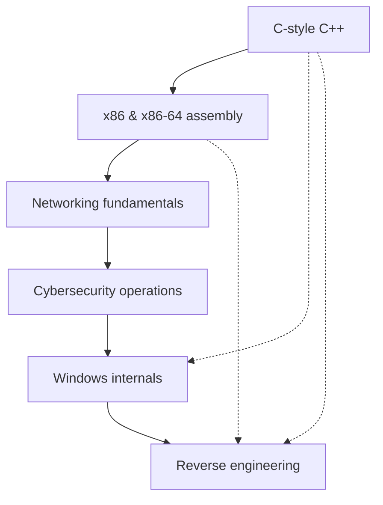

<h1 align="center">Cybersecurity & Code Insights '25</h1>

<p align="center">
  
</p>

**An open-source guide / insights to C-style C++, x86, x86-64 assembly, cybersecurity operations and Windows internals into a unified learning resource.**

**Brief disclaimer:** This guide is catered towards cybersecurity development, not as much to cybersecurity operations / red teaming or blue teaming.

> [!TIP]
>  No prior knowledge is needed.
>
> However, if you are starting from the ground up I would recommend following path:



> [!TIP]
> - Add this folder to your windows defender exclusions as it might remove valuable resources.
> - Don't jump from topic to topic unless you know what you're doing. Most of the "steps" build on top of each other.
> - Install add-ons like [dark reader](https://darkreader.org/) and [remove HTML elements](https://chromewebstore.google.com/detail/remove-html-elements/enegojdnkeicfoiknhfjaedhlckeahmf?hl=en&pli=1) that make reading better.
> - If you really can't wrap your head around something, just ask [ChatGPT](https://chatgpt.com/) to clarify it.
> - Keep note of where you left off studying and make bookmarks in your browser application.

##  C-style C++
A C-style C++ summary of 2024. This summary is entirely possible thanks to the authors of the Learncpp website (Alex, Nascardriver and James C.) who made their knowledge available for public use.

**prerequisites:** None

[Summary PDF](/Programming_Foundations/Cpp/C-Style_CPP_24.pdf)

<details>
<summary> Modules </summary>

- Keywords
- Introduction / Getting started
- Basics
- Functions and files
- Debugging
- Fundamental data types
- Constants and strings
- Operators
- Bit manipulation
- Scope, duration & linkage
- Control flow
- Error detection and handling
- Type conversion, type aliases & type deduction
- Function overloading & function templates
- Compound types: References and pointers
- Compound types: Enums and structs
- Summary intermezzo
- C-style: Arrays & strings
- Dynamic allocation
- Functions

</details>

<details>
<summary> References </summary>

- [cppreference](https://en.cppreference.com/w/)
- [cplusplus reference](https://cplusplus.com/reference/)
- [W3Schools DSA Intro](https://www.w3schools.com/dsa/dsa_intro.php)
- [hackingcpp cheat sheets](https://hackingcpp.com/cpp/cheat_sheets.html)

</details>

##  x86 & x86-64 assembly
Note this guide was reworked from x86 to x86-64 for really exact and specific differences you should do your own research.

**prerequisites:** [C++](/readme.md#c-style-c)

<details>
<summary> Architecture </summary>

1. [Intro](/Programming_Foundations/Assembly/Architecture/Intro.md)
2. [x86 Architecture](/Programming_Foundations/Assembly/Architecture/Architecture.md)
3. [Modes of operation](/Programming_Foundations/Assembly/Architecture/Operating_Modes.md)
4. [Memory](/Programming_Foundations/Assembly/Architecture/Memory.md)
5. [CPU Registers](/Programming_Foundations/Assembly/Architecture/CPU_Registers.md)
6. [E Flags](/Programming_Foundations/Assembly/Architecture/E_Flags.md)
7. [Word Sizes](/Programming_Foundations/Assembly/Architecture/Sizes.md)
8. [The Stack](/Programming_Foundations/Assembly/Architecture/Call_Stack.md)
9. [Calling Conventions](/Programming_Foundations/Assembly/Architecture/Calling_Conventions.md)
10. [Instructions / Opcodes](/Programming_Foundations/Assembly/Architecture/Instructions.md)

</details>

<details>
<summary> Syntax </summary>

1. [Directives](/Programming_Foundations/Assembly/Architecture/Directives.md)
2. [Instructions](/Programming_Foundations/Assembly/Architecture/Instructions.md)
3. [Radix characters](/Programming_Foundations/Assembly/Architecture/Radix_Chars.md)
4. [Character constants](/Programming_Foundations/Assembly/Architecture/Character_Constants.md)
5. [Reserved words](/Programming_Foundations/Assembly/Architecture/Reserved_words.md)
6. [Identifiers](/Programming_Foundations/Assembly/Architecture/Identifiers.md)
7. [Declaring variables](/Programming_Foundations/Assembly/Architecture/Declaring_Variables.md)
8. [Operator precedence](/Programming_Foundations/Assembly/Architecture/Operator_Presedence.md)

</details>

<details>
<summary> Example programs </summary>

- [Example masm program](/Programming_Foundations/Assembly/Examples/hello_world.asm)
- [Example nasm program](/Programming_Foundations/Assembly/Examples/hello_world_nasm.asm)

</details>

> [!NOTE]
> To compile NASM on windows download [NASM](https://www.nasm.us/) & [w64devkit-x86](https://github.com/skeeto/w64devkit/releases/tag/v2.0.0).
> 
> Use NASM to assemble the .asm file into an object file (.obj). Run this command in the same directory where the .asm file is located:
> ```nasm -f win32 -o fileName.obj fileName.asm```
>
> Use GCC to link the .obj file and create the final executable (.exe). Run this command:
> ```gcc -mconsole -nostartfiles -o fileName.exe fileName.obj```

<details>
<summary> References </summary>

- [Godbolt Compiler Explorer](https://godbolt.org/)
- [JLearn PH's MASM32 assembly programming playlist](https://www.youtube.com/playlist?list=PLE6kld48wGGPEq1mDnFVfbLZ81gcP3nJj)
- [MASM reference](https://learn.microsoft.com/en-us/cpp/assembler/masm/microsoft-macro-assembler-reference?view=msvc-170) for more information on x86 assembly in MASM32.
- [x86 and amd64 instruction reference](https://www.felixcloutier.com/x86/) for more information on x86 instructions.
- [Malwareunicorn's instruction searcher](https://malwareunicorn.org/x86)
- [Tutorialspoint Nasm assembly](https://www.tutorialspoint.com/assembly_programming/index.htm)
- [Davy Wybiral's intro to x86 assembly language playlist](https://www.youtube.com/playlist?list=PLmxT2pVYo5LB5EzTPZGfFN0c2GDiSXgQe)
- [OliveStem's x86 assembly with NASM playlist](https://www.youtube.com/playlist?list=PL2EF13wm-hWCoj6tUBGUmrkJmH1972dBB)
- [ost2.fyi's Architecture 2001: x86-64 OS Internals](https://p.ost2.fyi/courses/course-v1:OpenSecurityTraining2+Arch2001_x86-64_OS_Internals+2021_v1/about)
- [asmtutor](https://asmtutor.com/)

</details>


##  Networking & Cybersecurity operations
Covers the fundamentals of both offensive and defensive security skills, ethical hacking, penetration testing, and red teaming, providing hands-on experience with tools like Nmap, Burp Suite, and SQLmap. It includes topics such as reconnaissance, exploitation, privilege escalation, and persistence, with cheat sheets and scripting resources to aid practical learning.

**prerequisites:** None

<details>
<summary> Modules </summary>

<details>
<summary> Fundamentals & general info </summary>

1. [Pentesting Fundamentals](/Cybersecurity_Operations/General/PentestingFundamentals.md)
2. [Principles of Security](/Cybersecurity_Operations/General/SecurityPrinciples.md)
3. [Red teaming fundamentals](/Cybersecurity_Operations/General/RTFundamentals.md)
4. [Red teaming engagements](/Cybersecurity_Operations/General/RTEngagements)
5. [Governance & Regulation](/Cybersecurity_Operations/General/Governance%26Regulation.md)

</details>

<details>
<summary> Cheat Sheets </summary>

1. [Networking](/Cybersecurity_Operations/Cheat%20Sheets/Networking.md)
2. [Linux](/Cybersecurity_Operations/Cheat%20Sheets/Linux.md)
3. [Windows](/Cybersecurity_Operations/Cheat%20Sheets/Windows.md)
4. [Windows CLI](/Cybersecurity_Operations/Cheat%20Sheets/WindowsCLI.md)
5. [Cryptography](/Cybersecurity_Operations/Cheat%20Sheets/Cryptography.md)
6. [Vulnerabilities](/Cybersecurity_Operations/Cheat%20Sheets/Vulnerabilities.md)

</details>

<details>
<summary> Planning & Recon </summary>

1. [Planning](/Cybersecurity_Operations/Planning%20%26%20Recon/Planning.md)
2. [Recon](/Cybersecurity_Operations/Planning%20%26%20Recon/Recon.md)

</details>

<details>
<summary> Scanning </summary>

1. [Nmap](/Cybersecurity_Operations/Scanning/Nmap.md)
2. [Directory Scanners](/Cybersecurity_Operations/Scanning/DirectoryScanners.md)
3. [SQLmap](/Cybersecurity_Operations/Scanning/SQLmap.md)

</details>

<details>
<summary> Gaining Access </summary>

1. [Web Enumeration](/Cybersecurity_Operations/Gaining%20Access/WebEnum.md)
2. [OWASP Top 10](/Cybersecurity_Operations/Gaining%20Access/OWASP10.md)
3. [Exploitation](/Cybersecurity_Operations/Gaining%20Access/Exploitation.md)
4. [Phishing](/Cybersecurity_Operations/Gaining%20Access/Phishing.md)

</details>

<details>
<summary> Tools used to gain access </summary>

1. [Burpsuite](/Cybersecurity_Operations/Gaining%20Access/Burpsuite.md)
2. [Hydra](/Cybersecurity_Operations/Gaining%20Access/Hydra.md)

</details>

<details>
<summary> Maintaining Access </summary>

1. [Shells](/Cybersecurity_Operations/Maintaining%20Access/Shells.md)
2. [Linux privilege escalation](/Cybersecurity_Operations/Maintaining%20Access/LinPrivesc.md)
3. [Windows privilege escalation](/Cybersecurity_Operations/Maintaining%20Access/WinPrivesc.md)
4. [Windows persistence](/Cybersecurity_Operations/Maintaining%20Access/WinPersistence.md)

</details>

<details>
<summary> Analysis </summary>

1. [CAPA](/Analysis/CAPA.md)
2. [REMnux & FlareVM](/Cybersecurity_Operations/Analysis/REMnux&FlareVM.md)
3. [Malware analysis and reverse engineering](/readme.md#reverse-engineering)

</details>

<details>
<summary> Scripting </summary>

1. [Python for pentesters](/Cybersecurity_Operations/Scripting/PythonForPentesters.md)

</details>

</details>

<details>
<summary> References </summary>

- [TryHackMe](https://tryhackme.com/)
- [A-Z Index of the Linux command line: bash + utilities](https://ss64.com/bash/)
- [IANA's Service Name and Transport Protocol Port Number Registry](https://www.iana.org/assignments/service-names-port-numbers/service-names-port-numbers.xhtml)

</details>

##  Windows Internals
This part explores Windows system architecture focusing on components such as processes, memory management, the Portable Executable (PE) file format.

It provides foundational knowledge for reverse engineering, malware analysis, and low-level Windows security research.

**prerequisites:** [C++](/readme.md#c-style-c)

<details>
<summary> Modules </summary>

1. [Windows Internals Overview](/Windows_Internals/Internals.md)
2. [Memory](/Windows_Internals/Memory.md)
3. [PE file format](/Windows_Internals/PE.md)
4. [Introduction to API's](/Windows_Internals/API.md)
5. [Windows API](/Windows_Internals/Windows_API.md)

</details>

<!--Syscalls? Drivers, sockets?-->

<details>
<summary> References </summary>

- [Pavel Yosifovich's windows internals](https://scorpiosoftware.net/)
- [Pavel Yosifovich's youtube channel](https://www.youtube.com/@zodiacon)
- [0xRick's dive into PE file format](https://0xrick.github.io/)
- [Empyreal96's info depot](https://empyreal96.github.io/nt-info-depot/index.html)
- [Alex Ionescu's blog](https://www.alex-ionescu.com/)
- [Duncan Ogilvie's internals crash course](https://www.youtube.com/watch?v=I_nJltUokE0)
- [Alexander Sotirov's internals talk](https://www.youtube.com/watch?v=vz15OqiYYXo&t=194s)
- [Crow's malware development playlist](https://www.youtube.com/playlist?list=PL_z_ep2nxC57sHAlCcvvaYRrpdMIQXri1)
- [Red Team Notes on reversing, forensics & misc](https://www.ired.team/miscellaneous-reversing-forensics/windows-kernel-internals)
- [Rexir's Windows Internals Videos](https://www.youtube.com/playlist?list=PLt9cUwGw6CYF6Kj19mBZpfhQPsRIC5vGl)
- [TheSourceLens's Windows Internals part 1 playlist](https://www.youtube.com/playlist?list=PLhx7-txsG6t5i-kIZ_hwJSgZrnka4GXvn)
- [Nir Lichtman's diving into windows internals playlist](https://www.youtube.com/playlist?list=PL0tgH22U2S3G2QpiK-Q1wKW_Fe-Wiu7JS)
- [Geoff Chappell](https://www.geoffchappell.com/index.htm?ta=5)
- [Alex Ionescu's ReactOS](https://doxygen.reactos.org/index.html)
- [Programming reference for the Win32 API](https://learn.microsoft.com/en-us/windows/win32/api/)
- [ost2.fyi](https://p.ost2.fyi/courses)
- [mr.d0x's malapi list](https://malapi.io/)
- [pinvoke.net](https://www.pinvoke.net/)

</details>

##  Reverse Engineering
Covers reverse engineering techniques, including static and dynamic analysis, debugging, and anti-reversing methods.

**prerequisites:** [C++](/readme.md#c-style-c) & [x86-64 Assembly](/readme.md#x86--x86-64-assembly)

<details>
<summary> Modules </summary>

1. [Intro to (malware) analysis](/Reverse_Engineering/Intro.md)
2. [Understand PE header files](/Windows_Internals/PE.md)
3. [Basic static analysis](/Reverse_Engineering/Basic_static.md)
4. [Advanced static analysis](/Reverse_Engineering/Advanced_static.md)
5. [Basic dynamic analysis](/Reverse_Engineering/Dynamic.md)
6. [Dynamic analysis: Debugging](/Reverse_Engineering/Dynamic_debugging.md)
7. [Anti-reverse engineering](/Reverse_Engineering/Anti_reversing.md)

</details>

<details>
<summary> References </summary>

- [TryHackMe](https://tryhackme.com/)
- [jstrosch's learning reverse engineering repo](https://github.com/jstrosch/learning-reverse-engineering)
- [Dr Josh Stroschein - The Cyber Yeti youtube channel](https://www.youtube.com/@jstrosch/playlists)
- [Godbolt Compiler Explorer](https://godbolt.org/)
- [Programming reference for the Win32 API](https://learn.microsoft.com/en-us/windows/win32/api/)
- [FLARE VM](https://github.com/mandiant/flare-vm)
- [REMnux](https://github.com/REMnux)
- [FLOSS](https://github.com/mandiant/flare-floss)
- [Reverse Engineering Resources-Beginners to intermediate Guide/Links](https://bbinfosec.medium.com/reverse-engineering-resources-beginners-to-intermediate-guide-links-f64c207505ed)
- [ost2.fyi](https://p.ost2.fyi/courses)
- [0xZ0F's Reverse Engineering Course repo](https://github.com/0xZ0F/Z0FCourse_ReverseEngineering)
- [wtsxDev's list of reverse engineering resources](https://github.com/wtsxDev/reverse-engineering)
- [Malwareunicorn's workshops](https://malwareunicorn.org/#/workshops)

</details>

<!--
##  Windows Exploit Development
Work in progress...

<details>
<summary> Modules </summary>
</details>

<details>
<summary> References </summary>
</details>

### Tooling
1. Introduction to Windows API (win32 API
2. Cheat engine
3. ReClass.NET
4. IDA pro
5. Sysinternals tools
6. Sysmon

### Exploit development
1. Basics
2. ROP
3. BufferOverflow
4. Memory corruption
5. Shellcoding

### Anti-analysis
1. Anti-Disassembly
2. Anti-Debugging
3. Game Integrity Checks
4. Obfuscation
5. Packers and unpacking
6. Bypassing Anti-Tamper technology
-->
