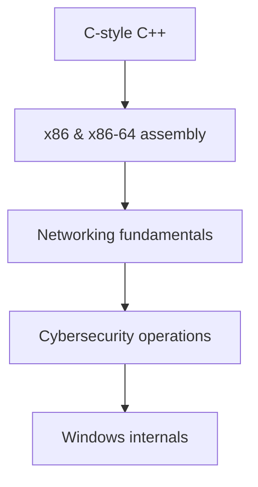

# Cybersecurity & Code Insights '25 

**An open-source guide / insights to x86, x86-64 assembly, C-style C++, cybersecurity operations and Windows internals into a unified learning resource.**

> [!IMPORTANT]
> This guide is catered towards cybersecurity development, not as much to cybersecurity operations / red teaming or blue teaming.

> [!TIP]
>  No prior knowledge is needed.
>
> However, if you are starting from the ground up I would recommend following path:



> [!TIP]
> - Add this folder to your windows defender exclusions as it might remove valuable resources.
> - Don't jump from topic to topic unless you know what you're doing. Most of the "steps" build on top of eachother.
> - Install add-ons like [dark reader](https://darkreader.org/) and [remove HTML elements](https://chromewebstore.google.com/detail/remove-html-elements/enegojdnkeicfoiknhfjaedhlckeahmf?hl=en&pli=1) that make reading better.
> - If you really can't wrap your head around something, just ask [ChatGPT](https://chatgpt.com/) to clarify it.
> - Keep note of where you left off studying and make bookmarks in your browser application.

## 1. Core programming and assembly foundations
### 1.1 C-style C++
A C-style C++ summary of 2024. This summary is entirely possible thanks to the authors of the Learncpp website (Alex, Nascardriver and James C.) who made their knowledge available for public use.

- [Summary PDF](/Programming_Foundations/Cpp/C-Style_CPP_24.pdf)

Contains:
- Keywords
- Introduction / Getting started
- Basics
- Functions and files
- Debugging
- Fundamental data types
- Constants and strings
- Operators
- Bit manipulation
- Scope, duration & linkage
- Control flow
- Error detection and handling
- Type conversion, type aliases & type deduction
- Function overloading & function templates
- Compound types: References and pointers
- Compound types: Enums and structs
- Summary intermezzo
- C-style: Arrays & strings
- Dynamic allocation
- Functions

#### References
- [cppreference](https://en.cppreference.com/w/)
- [cplusplus reference](https://cplusplus.com/reference/)
- [W3Schools DSA Intro](https://www.w3schools.com/dsa/dsa_intro.php)
- [hackingcpp cheat sheets](https://hackingcpp.com/cpp/cheat_sheets.html)


### 1.2 x86 & x86-64 assembly
Note this guide was reworked from x86 to x86-64 for really exact and specific differences you should do your own research.

#### Architecture
1. [Intro](/Programming_Foundations/Assembly/Architecture/Intro.md)
2. [x86 Architecture](/Programming_Foundations/Assembly/Architecture/Architecture.md)
3. [Modes of operation](/Programming_Foundations/Assembly/Architecture/Operating_Modes.md)
4. [Memory](/Programming_Foundations/Assembly/Architecture/Memory.md)
5. [CPU Registers](/Programming_Foundations/Assembly/Architecture/CPU_Registers.md)
6. [E Flags](/Programming_Foundations/Assembly/Architecture/E_Flags.md)
7. [Word Sizes](/Programming_Foundations/Assembly/Architecture/Sizes.md)
8. [The Stack](/Programming_Foundations/Assembly/Architecture/Call_Stack.md)
9. [Calling Conventions](/Programming_Foundations/Assembly/Architecture/Calling_Conventions.md)
10. [Instructions / Opcodes](/Programming_Foundations/Assembly/Architecture/Instructions.md)

#### x86 Syntax
1. [Directives](/Programming_Foundations/Assembly/Architecture/Directives.md)
2. [Instructions](/Programming_Foundations/Assembly/Architecture/Instructions.md)
3. [Radix characters](/Programming_Foundations/Assembly/Architecture/Radix_Chars.md)
4. [Character constants](/Programming_Foundations/Assembly/Architecture/Character_Constants.md)
5. [Reserved words](/Programming_Foundations/Assembly/Architecture/Reserved_words.md)
6. [Identifiers](/Programming_Foundations/Assembly/Architecture/Identifiers.md)
7. [Declaring variables](/Programming_Foundations/Assembly/Architecture/Declaring_Variables.md)
8. [Operator presedence](/Programming_Foundations/Assembly/Architecture/Operator_Presedence.md)

#### Example programs
> [!NOTE]
> To compile NASM on windows download [NASM](https://www.nasm.us/) & [w64devkit-x86](https://github.com/skeeto/w64devkit/releases/tag/v2.0.0).
> 
> Use NASM to assemble the .asm file into an object file (.obj). Run this command in the same directory where the .asm file is located:
> ```nasm -f win32 -o fileName.obj fileName.asm```
>
> Use GCC to link the .obj file and create the final executable (.exe). Run this command:
> ```gcc -mconsole -nostartfiles -o fileName.exe fileName.obj```

- [Example masm program](/Programming_Foundations/Assembly/Examples/hello_world.asm)
- [Example nasm program](/Programming_Foundations/Assembly/Examples/hello_world_nasm.asm)

#### References
- [JLearn PH's MASM32 assembly programming playlist](https://www.youtube.com/playlist?list=PLE6kld48wGGPEq1mDnFVfbLZ81gcP3nJj)
- [MASM reference](https://learn.microsoft.com/en-us/cpp/assembler/masm/microsoft-macro-assembler-reference?view=msvc-170) for more information on x86 assembly in MASM32.
- [x86 and amd64 instruction reference](https://www.felixcloutier.com/x86/) for more information on x86 instructions.
- [Tutorialspoint Nasm assembly](https://www.tutorialspoint.com/assembly_programming/index.htm)
- [Davy Wybiral's intro to x86 assembly language playlist](https://www.youtube.com/playlist?list=PLmxT2pVYo5LB5EzTPZGfFN0c2GDiSXgQe)
- [OliveStem's x86 assembly with NASM playlist](https://www.youtube.com/playlist?list=PL2EF13wm-hWCoj6tUBGUmrkJmH1972dBB)


## 2. Cybersecurity operations
### 2.1 General info
1. [Pentesting Fundamentals](/Cybersecurity_Operations/General/PentestingFundamentals.md)
2. [Principles of Security](/Cybersecurity_Operations/General/SecurityPrinciples.md)
3. [Red teaming fundamentals](/Cybersecurity_Operations/General/RTFundamentals.md)
4. [Red teaming engagements](/Cybersecurity_Operations/General/RTEngagements)
5. [Governance & Regulation](/Cybersecurity_Operations/General/Governance%26Regulation.md)

### 2.2 Cheat Sheets
1. [Networking](/Cybersecurity_Operations/Cheat%20Sheets/Networking.md)
2. [Linux](/Cybersecurity_Operations/Cheat%20Sheets/Linux.md)
3. [Windows](/Cybersecurity_Operations/Cheat%20Sheets/Windows.md)
4. [Windows CLI](/Cybersecurity_Operations/Cheat%20Sheets/WindowsCLI.md)
5. [Cryptography](/Cybersecurity_Operations/Cheat%20Sheets/Cryptography.md)
6. [Vulnerabilities](/Cybersecurity_Operations/Cheat%20Sheets/Vulnerabilities.md)

### 2.3 Planning & Recon
1. [Planning](/Cybersecurity_Operations/Planning%20%26%20Recon/Planning.md)
2. [Recon](/Cybersecurity_Operations/Planning%20%26%20Recon/Recon.md)

### 2.4 Scanning
1. [Nmap](/Cybersecurity_Operations/Scanning/Nmap.md)
2. [Directory Scanners](/Cybersecurity_Operations/Scanning/DirectoryScanners.md)
3. [SQLmap](/Cybersecurity_Operations/Scanning/SQLmap.md)

### 2.5 Gaining Access
1. [Web Enumeration](/Cybersecurity_Operations/Gaining%20Access/WebEnum.md)
2. [OWASP Top 10](/Cybersecurity_Operations/Gaining%20Access/OWASP10.md)
3. [Exploitation](/Cybersecurity_Operations/Gaining%20Access/Exploitation.md)
4. [Phishing](/Cybersecurity_Operations/Gaining%20Access/Phishing.md)

#### Tools used to gain access
1. [Burpsuite](/Cybersecurity_Operations/Gaining%20Access/Burpsuite.md)
2. [Hydra](/Cybersecurity_Operations/Gaining%20Access/Hydra.md)

### 2.6 Maintaining Access
1. [Shells](/Cybersecurity_Operations/Maintaining%20Access/Shells.md)
2. [Linux priveledge escalation](/Cybersecurity_Operations/Maintaining%20Access/LinPrivesc.md)
3. [Windows priveledge escalation](/Cybersecurity_Operations/Maintaining%20Access/WinPrivesc.md)
4. [Windows persistence](/Cybersecurity_Operations/Maintaining%20Access/WinPersistence.md)

### 2.7 Analysis
1. [CAPA](/Analysis/CAPA.md)
2. [REMnux & FlareVM](/Cybersecurity_Operations/Analysis/REMnux&FlareVM.md)

### 2.8 Scripting
1. [Python for pentesters](/Cybersecurity_Operations/Scripting/PythonForPentesters.md)

#### References
[TryHackMe](https://tryhackme.com/)


## 3. Windows Internals
### 3.1 Windows internals Overview
1. [Windows Internals Overview](/Windows_Internals/Internals.md)

### 3.2 Memory
1. [Memory](/Windows_Internals/Memory.md)

### 3.2 Portable executable (PE) file format & Packing
1. [PE file format](/Windows_Internals/PE.md)

<!--
### 3.3 TO DO: Reverse engineering
- Basic dynamic analysis
- Dynamic analysis: debugging
- Windows reversing intro
- Anti Reverse Engineering

### 3.4 TO DO: Tooling
1. Introduction to Windows API (win32 API
2. Cheat engine
3. ReClass.NET
4. IDA pro
5. Sysinternals tools
6. Sysmon
-->

#### References
- [Pavel Yosifovich's windows internals](https://scorpiosoftware.net/)
- [Pavel Yosifovich's youtube channel](https://www.youtube.com/@zodiacon)
- [0xRick's dive into PE file format](https://0xrick.github.io/)
- [Empyreal96's info depot](https://empyreal96.github.io/nt-info-depot/index.html)
- [Alex Ionescu's blog](https://www.alex-ionescu.com/)
- [Duncan Ogilvie's internals crash course](https://www.youtube.com/watch?v=I_nJltUokE0)
- [Alexander Sotirov's internals talk](https://www.youtube.com/watch?v=vz15OqiYYXo&t=194s)
- [Crow's malware development playlist](https://www.youtube.com/playlist?list=PL_z_ep2nxC57sHAlCcvvaYRrpdMIQXri1)
- [Red Team Notes on reversing, forensics & misc](https://www.ired.team/miscellaneous-reversing-forensics/windows-kernel-internals)
- [Rexir's Windows Internals Videos](https://www.youtube.com/playlist?list=PLt9cUwGw6CYF6Kj19mBZpfhQPsRIC5vGl)
- [TheSourceLens's Windows Internals part 1 playlist](https://www.youtube.com/playlist?list=PLhx7-txsG6t5i-kIZ_hwJSgZrnka4GXvn)
- [Nir Lichtman's diving into windows internals playlist](https://www.youtube.com/playlist?list=PL0tgH22U2S3G2QpiK-Q1wKW_Fe-Wiu7JS)
- [Geoff Chappell](https://www.geoffchappell.com/index.htm?ta=5)
- [Alex Ionescu's ReactOS](https://doxygen.reactos.org/index.html)